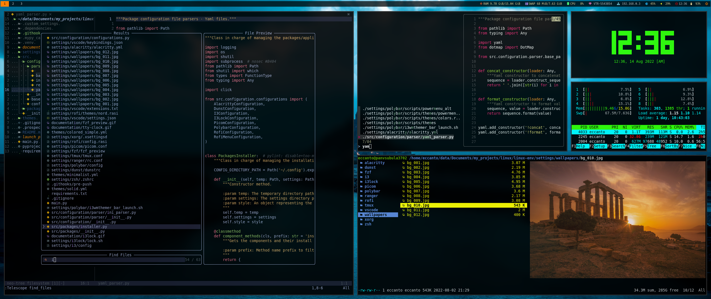
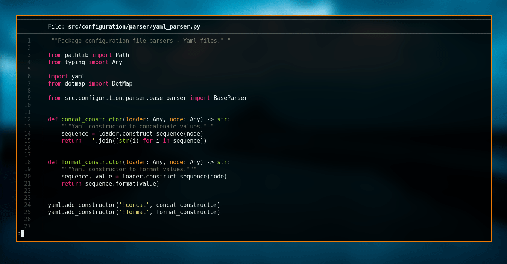
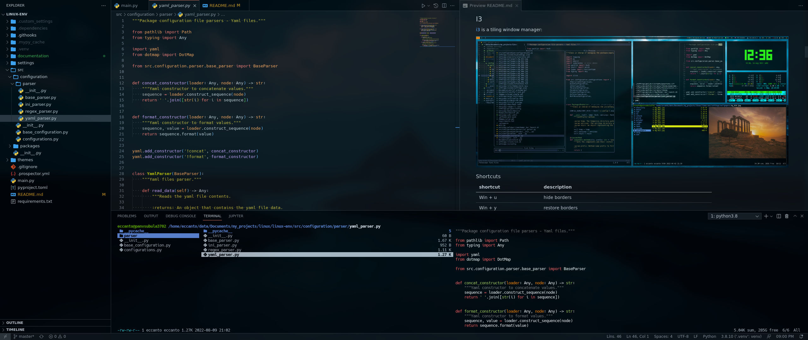
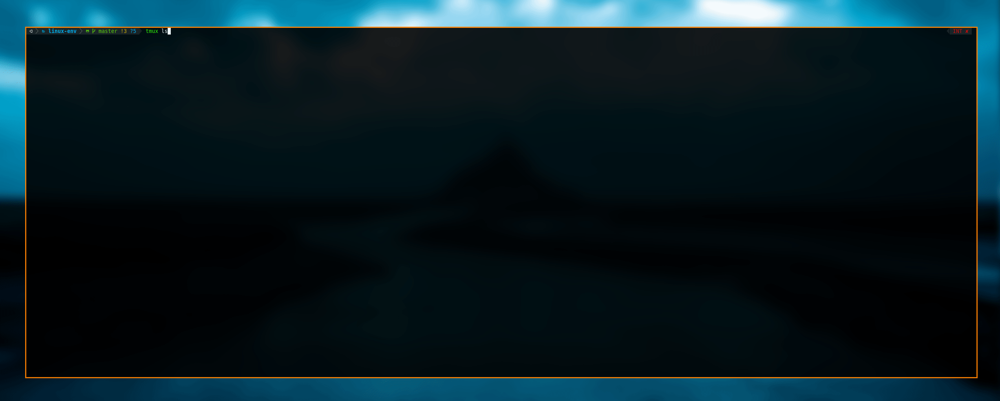
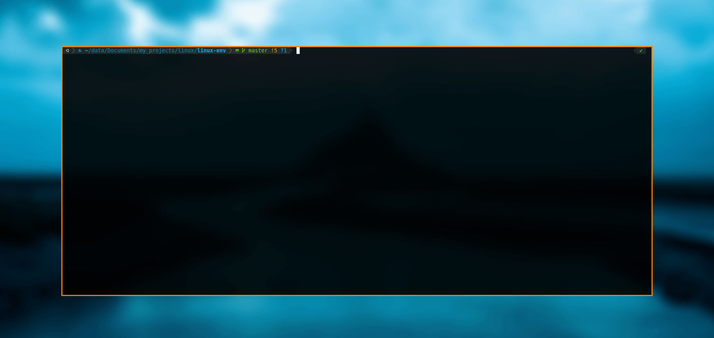
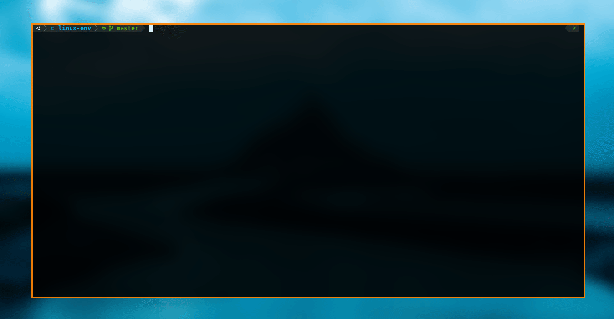
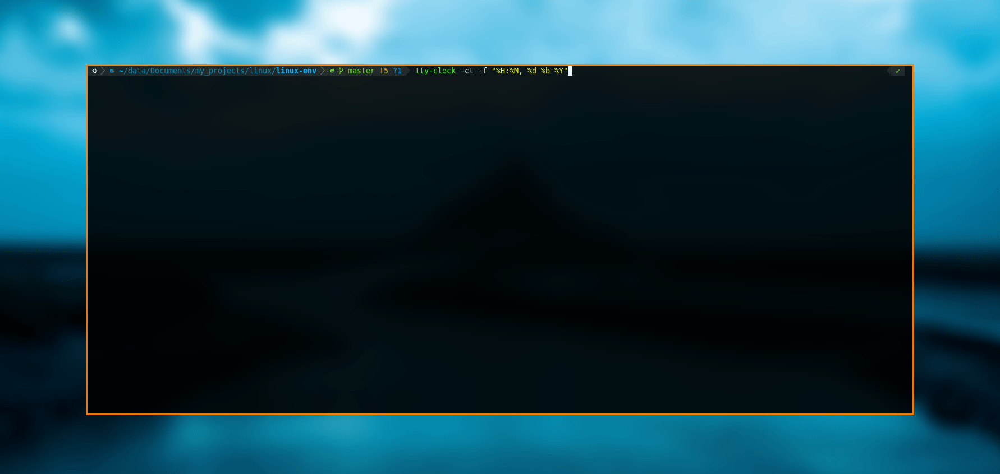
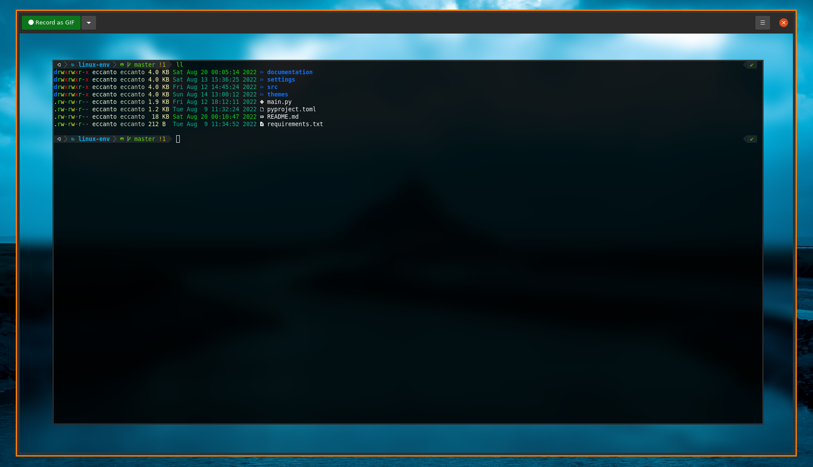
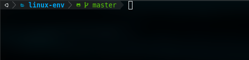

**`WIP`**

# Overview

Configuration of my Linux environment.


# Table of contents

- [Overview](#overview)
- [Table of contents](#table-of-contents)
- [Get started](#get-started)
  - [Create a Python virtual environment](#create-a-python-virtual-environment)
  - [Install dependencies](#install-dependencies)
  - [Setup environment](#setup-environment)
- [Tools](#tools)
  - [I3](#i3)
  - [I3Lock](#i3lock)
  - [Rofi](#rofi)
    - [Rofi executables explorer](#rofi-executables-explorer)
    - [Rofi applications explorer](#rofi-applications-explorer)
    - [Rofi System menu](#rofi-system-menu)
  - [VSCode](#vscode)
  - [Neovim](#neovim)
  - [Tmux](#tmux)
  - [fzf preview](#fzf-preview)
  - [Ranger](#ranger)
  - [tty-clock](#tty-clock)
  - [Peek](#peek)
  - [Flameshot](#flameshot)
- [Useful](#useful)
  - [Change keyboard layout](#change-keyboard-layout)
  - [Search icons in system fonts](#search-icons-in-system-fonts)
  - [Generate monitor profile](#generate-monitor-profile)
  - [Reconfigure powerlevel10k](#reconfigure-powerlevel10k)
  - [Disable underlining of the powerlevel10k zsh-syntax-highlighting plugin](#disable-underlining-of-the-powerlevel10k-zsh-syntax-highlighting-plugin)
  - [Fix polybar brightness module on amd card](#fix-polybar-brightness-module-on-amd-card)
  - [Set polybar on multiple screens](#set-polybar-on-multiple-screens)
  - [Remove absolute path from current working directory](#remove-absolute-path-from-current-working-directory)
- [Developers](#developers)
  - [Static code analysis tools](#static-code-analysis-tools)
    - [Set up the Git hooks custom directory](#set-up-the-git-hooks-custom-directory)
    - [Python Static Checkers](#python-static-checkers)
- [Compatibility](#compatibility)
- [Disclaimer](#disclaimer)
- [License](#license)
- [Changelog](#changelog)

# Get started

## Create a Python virtual environment

```bash
# create
python3 -m venv .venv

# activate
source .venv/bin/activate
```

## Install dependencies

```bash
pip install -r requirements.txt
```

## Setup environment

##
```bash
python main.py -s themes/colored_simple.yml
```

# Tools

## I3

[i3](https://i3wm.org/) is a tiling window manager:




| shortcut                   | description                                                            |
|----------------------------|------------------------------------------------------------------------|
| Win + u                    | hide borders                                                           |
| Win + y                    | restore borders                                                        |
| Win + n                    | change to "normal" border mode (show window title)                     |
| Win + Shift + q            | kill focused window                                                    |
| Win + Enter                | open Alacritty terminal emulator                                       |
| Win + d                    | open Rofi - Application and executable explorer                        |
| Win + i                    | open Rofi - Application GUIs explorer                                  |
| Win + Escape               | open Rofi - System menu: poweroff, sleep, etc.                         |
| Win + Print                | open flameshot - screenshot capturer                                   |
| Win + l                    | lock screen session                                                    |
| Win + Left                 | focus left window                                                      |
| Win + Right                | focus right window                                                     |
| Win + Down                 | focus down window                                                      |
| Win + Up                   | focus up window                                                        |
| Win + Shift + Left         | move the focused window to left                                        |
| Win + Shift + Right        | move the focused window to right                                       |
| Win + Shift + Down         | move the focused window to down                                        |
| Win + Shift + Up           | move the focused window to up                                          |
| Win + Ctrl + Shift + Left  | move the focused workspace to left                                     |
| Win + Ctrl + Shift + Right | move the focused workspace to right                                    |
| Win + Ctrl + Shift + Down  | move the focused workspace to down                                     |
| Win + Ctrl + Shift + Up    | move the focused workspace to up                                       |
| Win + b                    | workspace back and forth                                               |
| Win + Shift + b            | move window to workspace back_and_forth                                |
| Win + h                    | change split mode to "horizontal"                                      |
| Win + v                    | change split mode to "vertical"                                        |
| Win + f                    | toggle fullscreen mode for the focused window                          |
| Win + s                    | change layout mode to "stacking"                                       |
| Win + w                    | change layout mode to "tabbed"                                         |
| Win + e                    | change layout mode to "toggle split"                                   |
| Win + Shift + Space        | toggle tiling / floating                                               |
| Win + Space                | change focus between tiling / floating windows                         |
| Win + Shift + s            | Sticky floating windows, even if you switch to another workspace       |
| Win + a                    | focus the parent window                                                |
| Win + Shift + Minus        | move the currently focused window to the scratchpad                    |
| Win + Shift                | show the next scratchpad window or hide the focused scratchpad window. |
| Win + Ctrl + Left          | focus left workspace                                                   |
| Win + Ctrl + Right         | focus right workspace                                                  |
| Win + Shift + c            | reload the configuration file                                          |
| Win + Shift + r            | restart i3 inplace                                                     |
| Win + Shift + e            | exit i3                                                                |
| Win + 0                    | Set shut down, restart and locking features                            |
| Win + r                    | enable resize windows mode                                             |
| Win + Shift + g            | enable gap mode                                                        |

## I3Lock

A modern version of i3lock with color functionality and other features ([github](https://github.com/Raymo111/i3lock-color)).




| shortcut | description                 |
|----------|-----------------------------|
| Win + l  | lock screen session borders |


## Rofi

A window switcher, Application launcher and dmenu replacement ([github](https://github.com/davatorium/rofi)).

### Rofi executables explorer


| shortcut | description                    |
|----------|--------------------------------|
| Win + d  | open Rofi executables explorer |

### Rofi applications explorer


| shortcut | description                     |
|----------|---------------------------------|
| Win + i  | open Rofi applications explorer |

### Rofi System menu


| shortcut     | description                     |
|--------------|---------------------------------|
| Win + Escape | open Rofi applications explorer |

## VSCode

[Visual Studio Code](https://code.visualstudio.com/) is a code editor redefined and optimized for building and debugging
modern web and cloud applications.




| shortcut                    | description                                                |
|-----------------------------|------------------------------------------------------------|
| Ctrl + b                    | if the `editor` is focused: toggle explorer view           |
| Ctrl + b                    | if the `terminal` is focused: focus previous editor group  |
| Alt  + [Left,Right,Up,Down] | focus [Left,Right,Up,Down] group and side bar (circularly) |
| Alt  + Up                   | if the `terminal` is focused: focus previous group         |
| Ctrl + [Left,Right,Up,Down] | move to [Left,Right,Up,Down] group                         |
| Ctrl + Alt + Shift + Right  | resize: increase group view width                          |
| Ctrl + Alt + Shift + Left   | resize: decrease group view width                          |
| Ctrl + Alt + Shift + Up     | resize: increase group view height                         |
| Ctrl + Alt + Shift + Down   | resize: decrease group view height                         |
| Ctrl + m                    | open markdown preview on the Side                          |
| Ctrl + g                    | go to line/column                                          |
| Ctrl + Shift + [Up,Down]    | move lines [Up,Down]                                       |
| Ctrl + Shift + d            | go to definition                                           |
| Ctrl + [Up,Down]            | scroll to [Up,Down]                                        |
| Alt  + Shift + [Left,Right] | select words [Left,Right]                                  |
| Alt  + Shift + [Up,Down]    | mark select multi-line [Up,Down]                           |
| Alt  + ,                    | go to back                                                 |
| Alt  + .                    | go to forward                                              |
| Ctrl + Enter                | open file in split view [from explorer view]               |

## Neovim

My Neovim configuration: [github](https://github.com/eccanto/nvim-config)


## Tmux

tmux is a terminal multiplexer: it enables a number of terminals to be created, accessed, and controlled from a single
screen. tmux may be detached from a screen and continue running in the background, then later reattached.
([github](https://github.com/tmux/tmux)).



| shortcut                    | description                 |
|-----------------------------|-----------------------------|
| tmux                        | start new                   |
| tmux new -s <NAME>          | start new with session name |
| tmux a                      | attach                      |
| tmux a -t <NAME>            | attach to named             |
| tmux ls                     | list sessions               |
| tmux kill-session -t <NAME> | kill session                |
| [Ctrl + b] s                | list sessions               |
| [Ctrl + b] c                | create window               |
| [Ctrl + b] w                | list windows                |
| [Ctrl + b] n                | next window                 |
| [Ctrl + b] p                | previous window             |
| [Ctrl + b] f                | find window                 |
| [Ctrl + b] ,                | rename window               |
| [Ctrl + b] &                | kill window                 |
| [Ctrl + b] %                | vertical split              |
| [Ctrl + b] "                | horizontal split            |
| [Ctrl + b] o                | swap panes                  |
| [Ctrl + b] q                | show pane numbers           |
| [Ctrl + b] x                | kill pane                   |
| [Ctrl + b] d                | detach tmux                 |

## fzf preview

A custom script to preview and open files in your system:

```bash
fzf_preview
```



Depending on the type of file selected, a different application will be used to open it:
- images: `feh -x`
- directories: `code`
- other file types: `nvim`


| shortcut | description                 |
|----------|-----------------------------|
| Win + c  | open fzf_preview in a new alacritty floating window |

## Ranger

A VIM-inspired filemanager for the console ([github](https://github.com/ranger/ranger)).




| shortcut  | description                     |
|-----------|---------------------------------|
| i         | display file (preview)          |
| Shift + s | open shell on current directory |
| F2        | rename selected file/directory  |
| yy        | copy selected file/directory    |
| pp        | paste selected file/directory   |
| dD        | delete selected file/directory  |
| Alt   + j | scroll preview down             |
| Alt   + k | scroll preview up               |
| Ctrl  + r | reset                           |
| Shift + w | display logs                    |

## tty-clock

Open digital clock in terminal.

```bash
tty-clock -ct -f "%H:%M, %d %b %Y"
```



## Peek

Simple screen recorder with an easy to use interface ([github](https://github.com/phw/peek)):

```bash
peek
```



## Flameshot

Powerful yet simple to use screenshot software ([github](https://github.com/flameshot-org/flameshot)).


# Useful

## Change keyboard layout

```bash
# change to Español latam
setxkbmap -layout latam
```

To make this configuration permanent you can add "setxkbmap -layout latam" to `~/.config/i3/config` or use another
autostart configuration file.

```bash
# Autostart applications
exec_always --no-startup-id setxkbmap -layout latam
```

## Search icons in system fonts

```bash
sudo apt install gucharmap

gucharmap
```

## Generate monitor profile

```bash
arandr
```

Relocate the monitors and save the profile "Layout -> Save as" (bash file). You can generate multiple profiles for different situations (home, office, etc.).

## Reconfigure powerlevel10k

```bash
p10k configure
```

## Disable underlining of the powerlevel10k zsh-syntax-highlighting plugin

Add the following to your `.zshrc`:

```bash
(( ${+ZSH_HIGHLIGHT_STYLES} )) || typeset -A ZSH_HIGHLIGHT_STYLES
ZSH_HIGHLIGHT_STYLES[path]=none
ZSH_HIGHLIGHT_STYLES[path_prefix]=none
```

## Fix polybar brightness module on amd card

1. get card name:

    ```bash
    $ ls -1 /sys/class/backlight/
    amdgpu_bl0
    ```

2. update polybar configuration file:

    ```bash
    # file: ~/.config/polybar/config
    # card = intel_backlight
    card = amdgpu_bl0
    ```

3. restart polybar

    ```bash
    pkill polybar && polybar i3wmthemer_bar &
    ```

4. [optional] if permission denied

    ```bash
    sudo chmod a+rw /sys/class/backlight/$(ls /sys/class/backlight/ | head -n 1)/brightness
    ```

## Set polybar on multiple screens

1. Create a polybar launcher script:

    ```bash
    # launch_polybar.sh

    if type "xrandr"; then
        for m in $(xrandr --query | grep " connected" | cut -d" " -f1); do
            MONITOR=$m polybar --reload i3wmthemer_bar &
        done
    else
        polybar --reload i3wmthemer_bar &
    fi
    ```

2. Edit the polybar config file (`~/.config/polybar/config`):

    ```
    [bar/i3wmthemer_bar]
    monitor = ${env:MONITOR:}
    ...
    ```

3. Kill current polybar:

    ```
    sudo pkill polybar
    ```

4. Run script:

    ```
    bash launch_polybar.sh
    ```

## Remove absolute path from current working directory

Edit `~/.p10k.zsh`, search for `POWERLEVEL9K_DIR_TRUNCATE_BEFORE_MARKER` and change its value to `first`:

```bash
  typeset -g POWERLEVEL9K_DIR_TRUNCATE_BEFORE_MARKER=first
```



# Developers

## Static code analysis tools

These are the linters that will help us to follow good practices and style guides of our source
code. We will be using the following static analysis tools, which will be executed when generating
a new commit in the repository (**git hooks**).

### Set up the Git hooks custom directory

After cloning the repository run the following command in the repository root:

```bash
git config core.hooksPath .githooks
```

### Python Static Checkers

Tools used:
- [black](https://github.com/psf/black): Black is the uncompromising Python code formatter.
- [isort](https://pycqa.github.io/isort/): Python utility / library to sort imports alphabetically, and automatically separated into sections and by type.
- [prospector](https://github.com/PyCQA/prospector): Prospector is a tool to analyse Python code and output information about errors, potential problems, convention violations and complexity.

  Tools executed by Prospector:
  - [pylint](https://github.com/PyCQA/pylint): Pylint is a Python static code analysis tool which looks for programming errors,   helps enforcing a coding standard, sniffs for code smells and offers simple refactoring suggestions.
  - [bandit](https://github.com/PyCQA/bandit): Bandit is a tool designed to find common security issues.
  - [dodgy](https://github.com/landscapeio/dodgy): It is a series of simple regular expressions designed to detect things such as accidental SCM diff checkins, or passwords or secret keys hard coded into files.
  - [mccabe](https://github.com/PyCQA/mccabe): Complexity checker.
  - [mypy](https://github.com/python/mypy): Mypy is an optional static type checker for Python.
  - [pep257](https://github.com/PyCQA/pydocstyle): pep257 is a static analysis tool for checking compliance with Python PEP 257.
  - [pep8](https://pep8.readthedocs.io/en/release-1.7.x/): pep8 is a tool to check your Python code against some of the style conventions in PEP 8.
  - [pyflakes](https://github.com/PyCQA/pyflakes): Pyflakes analyzes programs and detects various errors.
  - [pyroma](https://github.com/regebro/pyroma): Pyroma is a product aimed at giving a rating of how well a Python project complies with the best practices of the Python packaging ecosystem, primarily PyPI, pip, Distribute etc, as well as a list of issues that could be improved.

# Compatibility

- Ubuntu 22.04 LTS [locally tested]
- Ubuntu 18.04 LTS [locally tested]

# Disclaimer

I am not responsible for any harm done to your PC by anything in the repository. Use everything with caution!

# License

[MIT](./LICENSE)

# Changelog

- 1.0.0 - Initial release.
